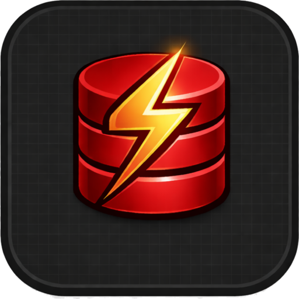
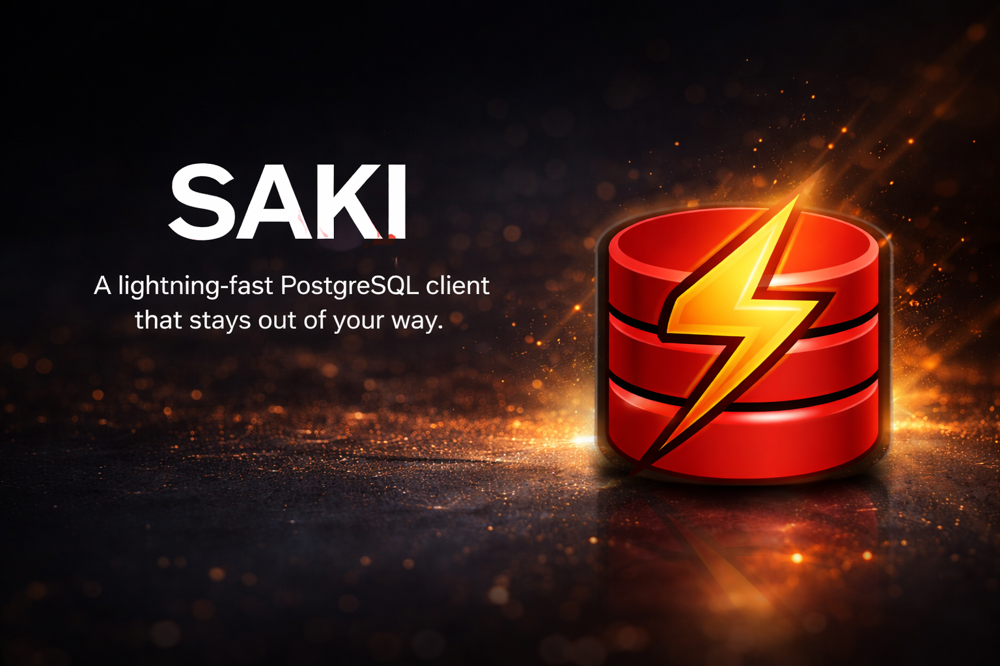

<p align="center">
  
</p>

<h1 align="center">Saki</h1>

<p align="center">
  A lightning-fast database client that stays out of your way.
</p>

<p align="center">
  <a href="https://github.com/nevindra/sakidb/releases"></a>
  <a href="https://github.com/nevindra/sakidb/blob/main/LICENSE"></a>
  <a href="https://github.com/nevindra/sakidb/stargazers"></a>
</p>

<p align="center">
  <a href="#install">Install</a>&nbsp;&nbsp;&middot;&nbsp;&nbsp;<a href="#highlights">Highlights</a>&nbsp;&nbsp;&middot;&nbsp;&nbsp;<a href="#features">Features</a>&nbsp;&nbsp;&middot;&nbsp;&nbsp;<a href="#contributing">Contributing</a>
</p>

<br />

<p align="center">
  
</p>

<br />

## Why Saki

Most database clients are either bloated Electron apps that eat your RAM for breakfast, or outdated native tools stuck in 2005.

Saki is different.

**Built native, not wrapped.** Tauri v2 + Rust backend. Sub-second startup. Binary IPC for query results. Your database client shouldn't need more memory than your database.

**Data-first interface.** No flashy dashboards. No distracting chrome. The UI steps aside so your query results take center stage — virtual-scrolled, resizable, editable, filterable.

**Multi-engine architecture.** PostgreSQL today, with SQLite, Redis, MongoDB, DuckDB, and ClickHouse on the roadmap. The UI adapts automatically — tree depth, context menus, toolbar controls, and structure tabs all adjust based on what your engine supports.

**Everything you need, nothing you don't.** Query editor with autocomplete, data grid with inline editing, schema explorer, ERD viewer, export/import — all in one app that opens faster than your browser tab.

<br />

## Highlights

### Query Editor

Full SQL editor powered by CodeMirror 6 — syntax highlighting, schema-aware autocomplete, SQL formatting, and multi-statement execution. Run everything, or just the statement at your cursor. Built-in EXPLAIN ANALYZE visualizer with table, tree, and raw views. Set per-query timeouts so runaway queries don't block your session.


### Data Grid

Virtual-scrolled results table that handles thousands of rows without breaking a sweat. Resizable columns, click a cell to expand, double-click a row for full detail. Sort, filter with SQL conditions, edit inline — with full undo support and batch commits wrapped in transactions. Add rows, delete rows, all keyboard-friendly.


### Schema Explorer

Browse your entire database structure in a hierarchical tree — databases, schemas, tables, views, materialized views, functions, sequences, foreign tables. Fuzzy search across everything. Right-click for quick actions: truncate, drop (with cascade), duplicate tables, export, and more.


### ERD Viewer

Auto-layout entity relationship diagrams with row count estimates on each node. Pan, zoom, drag nodes, hover to highlight foreign key connections. Minimap for orientation. Toggle simplified mode, search tables, export to PNG or SVG. Double-click a table to jump straight to its data.


<br />

## Features

Everything Saki can do, at a glance.

#### Query & Editing
| Feature | Description |
|---------|-------------|
| Multi-statement execution | Run multiple statements in one go, navigate results with <kbd>Alt</kbd>+<kbd>Arrow</kbd> |
| Schema-aware autocomplete | Context-aware suggestions for tables, columns, and functions |
| SQL formatting | One-click beautify for messy queries |
| EXPLAIN ANALYZE | Table, tree, and raw views for query plans |
| Query cancellation | Cancel long-running queries via PostgreSQL cancel signal |
| Query timeout | Set per-query execution time limits |
| Saved queries | Promote any query from history to your permanent library |
| Query history | Auto-saved with execution time and row count metrics |

#### Data Grid
| Feature | Description |
|---------|-------------|
| Virtual scrolling | Smooth scrolling through thousands of rows |
| Inline editing | Edit cells in place with undo/redo support |
| Row operations | Add, delete, and batch-commit rows in transactions |
| Column filters | Equals, contains, greater-than, is null — with date picker for timestamps |
| Resizable columns | Drag column borders to fit your data |
| Cell expand | Click to preview, double-click for full row detail panel |
| Context menu | Copy cell, copy row, copy as INSERT statement |

#### Schema & Structure
| Feature | Description |
|---------|-------------|
| Schema tree | Databases, schemas, tables, views, materialized views, functions, sequences, foreign tables |
| Fuzzy search | Instant search across your entire schema tree |
| Table structure | Columns, indexes, foreign keys, check constraints, unique constraints, triggers, partitions |
| Table profiling | Column statistics and data distribution with bar charts |
| DDL preview | View the full CREATE TABLE statement for any table |
| Table management | Rename, truncate, drop (with cascade), duplicate tables |
| ERD export | Save diagrams as PNG or SVG |

#### Connections & Data
| Feature | Description |
|---------|-------------|
| Connection manager | Save, edit, and test connections securely |
| Multi-engine | PostgreSQL now; SQLite, Redis, MongoDB, DuckDB, ClickHouse planned |
| Capability-aware UI | Tree, menus, toolbar, and tabs adapt to each engine's features |
| SSL/TLS support | Connect to databases with SSL encryption |
| Database management | Create, drop, and rename databases without leaving the app |
| CSV export | Stream large tables to CSV files |
| SQL export | Full DDL + data dump with progress tracking |
| SQL restore | Import `.sql` files with real-time progress and error handling |
| Command palette | Fuzzy-search any action with <kbd>Ctrl</kbd>+<kbd>K</kbd> |

<br />

## Install

### Download

Grab the latest release for your platform:

<p align="center">
  <a href="https://github.com/nevindra/sakidb/releases/latest"><strong>Download Saki &rarr;</strong></a>
</p>

| Platform | File |
|----------|------|
| **macOS** (Apple Silicon) | `.dmg` |
| **macOS** (Intel) | `.dmg` |
| **Linux** (Debian/Ubuntu) | `.deb` |
| **Linux** (AppImage) | `.AppImage` |
| **Windows** | `.msi` |

### Build from source

Requires [Rust](https://rustup.rs/), [Node.js](https://nodejs.org/), and [pnpm](https://pnpm.io/).

```bash
git clone https://github.com/nevindra/sakidb.git
cd sakidb
pnpm install
pnpm tauri build
```

The built application will be in `src-tauri/target/release/bundle/`.

<br />

## Built With

Tauri v2 &nbsp;+&nbsp; Svelte 5 &nbsp;+&nbsp; Rust

<br />

## Contributing

Contributions are welcome! Whether it's bug reports, feature requests, or pull requests — all input helps make Saki better.

### Getting started

```bash
git clone https://github.com/nevindra/sakidb.git
cd sakidb
pnpm install
pnpm tauri dev
```

### Project structure

```
crates/sakidb-core/       — Shared traits, types, errors (driver trait system)
crates/sakidb-postgres/   — PostgreSQL driver (feature-flagged)
crates/sakidb-store/      — Credential & query storage (encrypted)
src-tauri/                — Tauri app, DriverRegistry, IPC commands
src/                      — Svelte 5 frontend (capability-gated UI)
```

### Running tests

```bash
cargo test          # Rust tests
pnpm check          # TypeScript/Svelte type checking
```

### Before submitting a PR

- Run `cargo clippy` and fix any warnings
- Run `pnpm check` to ensure type safety
- Keep commits focused and descriptive

<br />

Have an idea? [Open an issue](https://github.com/nevindra/sakidb/issues/new) to start a discussion.

<br />

## License

[MIT](LICENSE)
